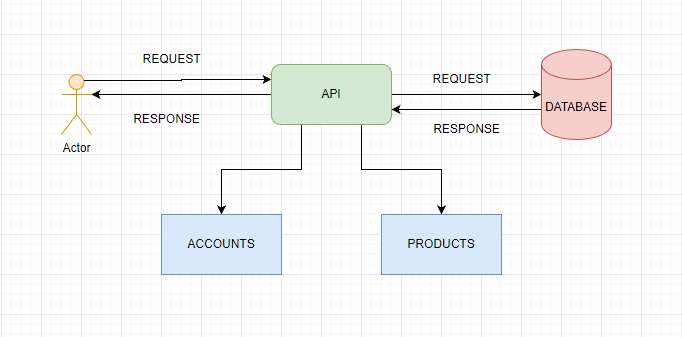
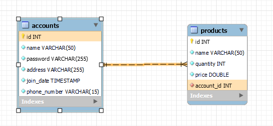

## Merchant Service

This is a merchant service API that can manage accounts and products. The account can **create** their own account and **update** it. And the account also possible to manage their own products such as:

1. Add new product
2. Get all product
3. Get detail product
4. Delete the product
5. Update the product

## Tech Stack

This project is made by:

<p float="left">


</p>

## Architecture Diagram



## Database models



## Database

This project doesn't contain database migrations, so you need to create the database and the tables by yourself, here is the syntax:

Create database:

```
CREATE DATABASE merchant_service;
```

Create accounts table:

```
CREATE TABLE `accounts` (
  `id`            INT NOT NULL AUTO_INCREMENT,
  `name`          VARCHAR(50) NOT NULL DEFAULT '',
  `password`      VARCHAR(255) NOT NULL DEFAULT '',
  `address`       VARCHAR(255) NOT NULL DEFAULT '',
  `join_date`     TIMESTAMP NOT NULL DEFAULT CURRENT_TIMESTAMP,
  `phone_number`  VARCHAR(15) NOT NULL DEFAULT '',
  PRIMARY KEY (`id`),
  UNIQUE KEY `id_unique` (`id`),
  UNIQUE KEY `name_unique` (`name`)
) ENGINE=InnoDB AUTO_INCREMENT=4 DEFAULT CHARSET=utf8mb4 COLLATE=utf8mb4_0900_ai_ci
```

Create products table:

```
CREATE TABLE `products` (
  `id`          INT NOT NULL AUTO_INCREMENT,
  `name`        VARCHAR(50) NOT NULL DEFAULT '',
  `quantity`    INT NOT NULL DEFAULT '1',
  `price`       DOUBLE NOT NULL DEFAULT '1',
  `account_id`  INT NOT NULL,
  PRIMARY KEY (`id`,`name`),
  KEY `fk_account_id_idx` (`account_id`),
  CONSTRAINT `fk_account_id` FOREIGN KEY (`account_id`) REFERENCES `accounts` (`id`)
) ENGINE=InnoDB AUTO_INCREMENT=4 DEFAULT CHARSET=utf8mb4 COLLATE=utf8mb4_0900_ai_ci
```

## How To Run It Locally

Clone the project:

```
git clone https://github.com/anggiirawan13/mini-project-merchant-service.git
```

Go to the project directory:

```
cd mini-project-merchant-service
```

Install dependencies:

```
npm install
```

Start the server:

```
npm run start
```

## Environment Variables

To run this project, you need to setup the following environment variables to your .env file:

```
SERVER_PORT=#custom_your_server_port

DB_HOST=127.0.0.1 OR localhost
DB_PORT=#custom_your_db_port
DB_USER=#custom_your_db_user
DB_PASS=#custom_your_db_pass
DB_NAME=merchant_service
```

## Postman Collection

- Here is the postman collection if you need to run the API using postman: [./Mini Project Merchant Service.postman_collection.json]
- Here is the postman environment if you need to run the API using postman: [./Mini Project Merchant Service.postman_environment.json]

## API Endpoints

| Methods   | Endpoints           | Descriptions      |
| --------- | ------------------- | ----------------- |
| POST      | /accounts           | Add new account   |
| PUT       | /accounts           | Update account    |
| POST      | /products           | Add new product   |
| GET       | /products           | Get all product   |
| GET BY ID | /products/detal?id= | Get product by id |
| PUT       | /products           | Update product    |
| DELETE    | /products?id=       | Delete product    |

<details>
<summary>API Details: </summary>

## #accounts

### POST /accounts

Add new account

- URL Params: None
- Data Params:

```
{
    "name": string,
    "password": string,
    "address": string,
    "phone_number": string
}
```

- Headers: Content-Type: application/json
- Success Response:
  - Code : 201
  - Content:
  ```
  {
    "isSuccess": true,
    "message": "STORE_SUCCESS"
  }
  ```
- Failed Response:
  1. - Code : 400
     - Content:
  ```
  {
    "isSuccess": false,
    "message": "DATA_ALREADY_EXIST"
  }
  ```
  2. - Code : 400
     - Content:
  ```
  {
    "isSuccess": false,
    "message": "PASSWORD_INVALID"
  }
  ```
  3. - Code : 400
     - Content:
  ```
  {
    "isSuccess": false,
    "message": "NAME_REQUIRED"
  }
  ```
  4. - Code : 400
     - Content:
  ```
  {
    "isSuccess": false,
    "message": "PASSWORD_REQUIRED"
  }
  ```
  5. - Code : 400
     - Content:
  ```
  {
    "isSuccess": false,
    "message": "ADDRESS_REQUIRED"
  }
  ```
  6. - Code : 400
     - Content:
  ```
  {
    "isSuccess": false,
    "message": "PHONE_NUMBER_REQUIRED"
  }
  ```

### PUT /accounts

Update account

- URL Params: None
- Data Params:

```
{
    "id": integer,
    "name": string,
    "password": string,
    "address": string,
    "phone_number": string
}
```

- Headers: Content-Type: application/json
- Success Response:
  - Code : 201
  - Content:
  ```
  {
    "isSuccess": true,
    "message": "UPDATE_SUCCESS"
  }
  ```
- Failed Response:
  1. - Code : 400
     - Content:
  ```
  {
    "isSuccess": false,
    "message": "DATA_ALREADY_EXIST"
  }
  ```
  2. - Code : 403
     - Content:
  ```
  {
    "isSuccess": false,
    "message": "ACCESS_FORBIDDEN"
  }
  ```
  3. - Code : 400
     - Content:
  ```
  {
    "isSuccess": false,
    "message": "PASSWORD_INVALID"
  }
  ```
  4. - Code : 400
     - Content:
  ```
  {
    "isSuccess": false,
    "message": "NAME_REQUIRED"
  }
  ```
  5. - Code : 400
     - Content:
  ```
  {
    "isSuccess": false,
    "message": "PASSWORD_REQUIRED"
  }
  ```
  6. - Code : 400
     - Content:
  ```
  {
    "isSuccess": false,
    "message": "ADDRESS_REQUIRED"
  }
  ```
  7. - Code : 400
     - Content:
  ```
  {
    "isSuccess": false,
    "message": "PHONE_NUMBER_REQUIRED"
  }
  ```

## #products

### POST /products

Add new product

- URL Params: None
- Data Params:

```
{
    "name": string,
    "quantity": integer,
    "price": double
}
```

- Headers: Content-Type: application/json
- Success Response:
  - Code : 201
  - Content:
  ```
  {
    "isSuccess": true,
    "message": "STORE_SUCCESS"
  }
  ```
- Failed Response:
  1. - Code : 400
     - Content:
  ```
  {
    "isSuccess": false,
    "message": "DATA_ALREADY_EXIST"
  }
  ```
  2. - Code : 400
     - Content:
  ```
  {
    "isSuccess": false,
    "message": "NAME_REQUIRED"
  }
  ```
  3. - Code : 400
     - Content:
  ```
  {
    "isSuccess": false,
    "message": "QUANTITY_REQUIRED"
  }
  ```
  4. - Code : 400
     - Content:
  ```
  {
    "isSuccess": false,
    "message": "PRICE_REQUIRED"
  }
  ```

### GET /products

Get all product

- URL Params: None
- Data Params: None
- Headers: Content-Type: application/json
- Success Response:
  - Code : 200
  - Content:
  ```
  {
    "isSuccess": true,
    "message": "GET_LIST_SUCCESS",
    "data": [
           {<product_object>},
           {<product_object>},
           {<product_object>}
         ]
  }
  ```
- Failed Response:
  1. - Code : 404
     - Content:
  ```
  {
    "isSuccess": false,
    "message": "DATA_NOT_FOUND"
  }
  ```

### GET /products/detail

Get detail product

- URL Params: None
- Data Params: None
- Query Params: ?id=
- Headers: Content-Type: application/json
- Success Response:
  - Code : 200
  - Content:
  ```
  {
    "isSuccess": true,
    "message": "GET_DATA_SUCCESS"
  }
  ```
- Failed Response:
  1. - Code : 404
     - Content:
  ```
  {
    "isSuccess": false,
    "message": "DATA_NOT_FOUND"
  }
  ```

  2. - Code : 400
     - Content:
  ```
  {
    "isSuccess": false,
    "message": "ID_REQUIRED"
  }
  ```
  
### PUT /products

Update product

- URL Params: None
- Data Params:

```
{
    "id": integer,
    "name": string,
    "quantity": integer,
    "price": double,
}
```

- Headers: Content-Type: application/json
- Success Response:
  - Code : 201
  - Content:
  ```
  {
    "isSuccess": true,
    "message": "UPDATE_SUCCESS"
  }
  ```
- Failed Response:
  1. - Code : 400
     - Content:
  ```
  {
    "isSuccess": false,
    "message": "DATA_ALREADY_EXIST"
  }
  ```
  2. - Code : 404
     - Content:
  ```
  {
    "isSuccess": false,
    "message": "DATA_NOT_FOUND"
  }
  ```
  3. - Code : 400
     - Content:
  ```
  {
    "isSuccess": false,
    "message": "NAME_REQUIRED"
  }
  ```
  4. - Code : 400
     - Content:
  ```
  {
    "isSuccess": false,
    "message": "QUANTITY_REQUIRED"
  }
  ```
  5. - Code : 400
     - Content:
  ```
  {
    "isSuccess": false,
    "message": "PRICE_REQUIRED"
  }
  ```

### DELETE /products

Delete product

- URL Params: None
- Data Params: None
- Query Params: ?id=
- Headers: Content-Type: application/json
- Success Response:
  - Code : 200
  - Content:
  ```
  {
    "isSuccess": true,
    "message": "DELETE_SUCCESS"
  }
  ```
- Failed Response:
  1. - Code : 404
     - Content:
  ```
  {
    "isSuccess": false,
    "message": "DATA_NOT_FOUND"
  }
  ```

  2. - Code : 400
     - Content:
  ```
  {
    "isSuccess": false,
    "message": "ID_REQUIRED"
  }
  ```
</details>
</html>